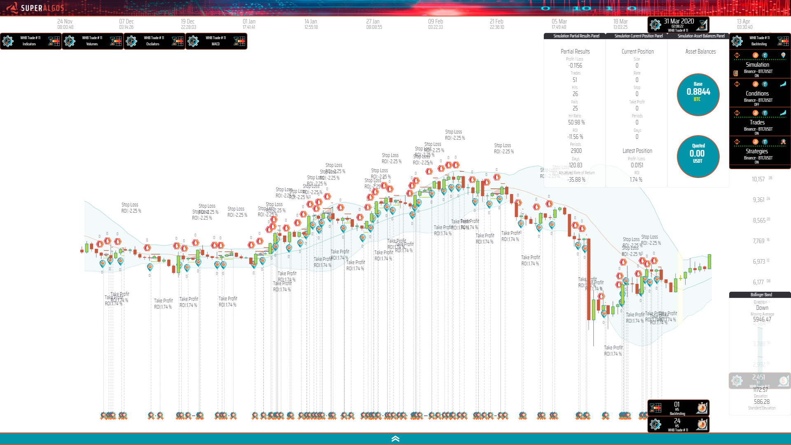

# About
This repository features an open-source crypto trading strategy maintained by the [Superalgos Community](https://t.me/superalgoscommunity). The strategy is currently work-in-progress, and is being built in a collaborative effort. Join the community to participate!

The trading system conforms to the Superalgos Trading Protocol, therefore, it may function as a fully automated trading system within [Superalgos](https://superalgos.org). 

People not interested in trading automation may still obtain the strategy's rules (situations, conditions, and formulas) from Superalgos' design space and use the set of rules as they see fit. Superalgos may also be used for testing trading ideas, for backtesting, and paper-trading (to obtain live signals!).

# BB Top Bounce (BBTB)

## Backtest Evolution

**Period:** 

* Dec 2019 - Mar 2020

**Assumptions**:

* Slippage: 0.1% in all orders.
* Fees: 0.1% in all orders.

### Original Idea

## Market

USDT-BTC, with BTC as the base asset.

## Strategy Goal

Accumulate bitcoin during ranging, consolidating and bear markets, with a moderate approach to risk so as to trade as frequently as possible.

## Trading Idea

The main trading idea is to identify bounces off the top band of the Bollinger Bands (BB) in the 1-hour chart to take short possitions on bitcoin as the price leaves the top band and heads for the lower band.

It's a low-frequency scalping idea, aiming mainly at short trades, a few hours long each.

# Disclaimer

> THIS IS NOT FINANCIAL ADVICE. ALTHOUGH THE STRATEGIES IN THIS REPOSITORY MAY BE FULLY FUNCTIONAL, WE DO NOT MAKE ANY EXPRESS OR IMPLIED RECOMMENDATION AS OF HOW YOU SHOULD USE THEM. WE SHARE STRATEGIES FOR EDUCATIONAL PURPOSES ONLY. TRADE AT YOUR OWN RISK.
